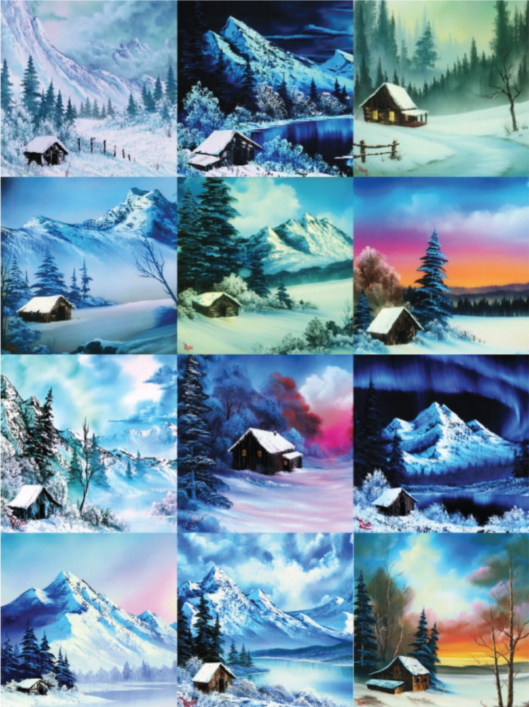

# Bob Ross Painting Analysis

Bob Ross what an iconic figure in the 80s and 90s. With his fabulous Afro and soothing voice, Bob Ross taught how to paint on a PBS TV show called, The Joy of Painting. His paintings had a wide range subjects. Examples of his art are below:

Curious about the range, trends, and patterns in Bob Ross's art, Walt Hickey of [FiveThirtyEight](https://abcnews.go.com/538) opted to tage 403 paintings from his show. The tagged data are available in the file [episode-by-element.csv](data/episode-by-element.csv). You can find the article as a PDF [here](notes/bobRossFiveThirtyEight.pdf), or here is the [link](https://fivethirtyeight.com/features/a-statistical-analysis-of-the-work-of-bob-ross/). There is also a GitHub Repository containing the data and some analysis with Python (though not a complete analysis) [here](https://github.com/fivethirtyeight/data/tree/master/bob-ross).

## Assignment

Using rationale and code from the previous image analysis assignments, analyze the data from the FiveThirtyEight article about Bob Ross and produce the following in R, either via R Markdown or a Jupyter Notebook:

1. A bar graph for the number of features seen
2. A list of the top 5 paintings with the most features
3. A plot with $k$ on the x-axis and within-cluster variance on the y-axis
4. A choice for $k$ based on the previous graph I chose 3, becasue any more had overlapping clusters
5. Cluster the paintings with your choice of $k$ and include a parallel plot that graphs the cluster centers.
6. An MDS of the paintings with the clusters color coded
7. Another summary of your choice; it can be any summary that you think is interesting.
8. A conclusion of your analysis with ***at least 3 insights***.
   Oceans were the most common body of water featured, and cluster 1 had a lot of River paintings.
   Doing an analysis with this many features makes getting anything out of graphs that include the whole data set is impossible.
    The max features in a painting is only 16, which is suprisingly low. I would have thought that there would be a painting densely packed with these features.
   A lot of the paintings included the sun
   
