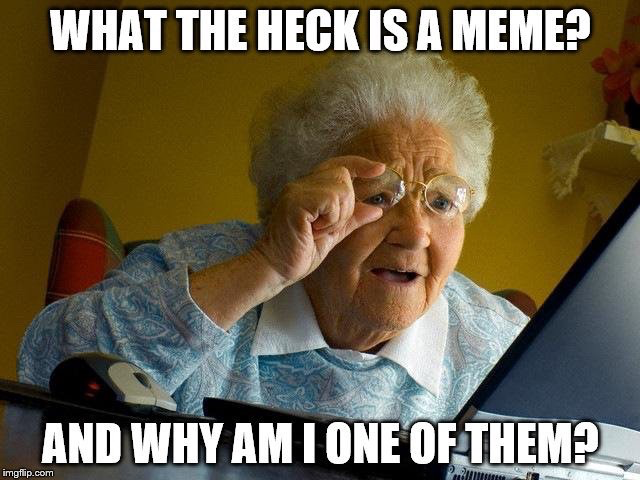

# Meme Analysis

## Day 1

As a class, you'll find ***school appropriate*** programming memes and place them into the `meme_images` folder in the shared Google Drive folder. Once you have ***at least 100 memes*** you can begin creating the data set `meme_data` in the google sheet provided.

You can get the memes from the following sources:

1. Mr. Venturi's memes
2. The internet
3. You make your own (will result in *gigachad* status, except if you use mematic; `gigachads` do not use mematic)

A NOTE ON DATA COLLECTION:

- You should be collecting memes that are ***school appropriate***.
- You should be collecting memes that are ***programming related***.
- You ARE ALL responsible for the data you collect as a class.
- I would recommend that you designate certain groups to a particular task (i.e. finding memes, categorizing memes, making memes, etc.)
- If you are gathering memes into the folder as you are supposed to I would recommend a standard naming convention for the memes. This will make it easier to categorize the memes later on, i.e. `meme_1.png`, `meme_2.png`, etc.
- YOU, yes YOU, the CLASS, are responsible for coming up with the features you will be analyzing in each meme. A group of students could be responsible for that.
- YOU, the individual student, will receive credit for participating so long as I see in the logs that you are participating in the data collection process.

## Day 2

You will be analyzing the memes that you as a class have collected. You will be using the `meme_data` google sheet as your data source.

1. Import the data whichever way you feel best. If you want to have the most up to date data, because some people may be updating it after you have already downloaded it, use an R package or some way to read the data directly from the google sheet on the internet into R.  [googlesheets4](https://googlesheets4.tidyverse.org/) is a good package to use for this.
2. Clean the data as needed.
3. A bar graph for the number of features seen
4. A list of the top 5 memes with the most features
5. A plot with $k$ on the x-axis and within-cluster variance on the y-axis
6. Cluster the memes with the best choice of $k$ (based on elbow graph) and include a parallel plot that graphs the cluster centers.
7. An MDS of the paintings with the clusters color coded
8. Another summary of your choice; it can be any summary that you think is interesting.
   - The summary must have a plot/graph of some kind.
   - No two individuals should have the same summary. Same summaries will result in a 0.
     - Some ideas (some of these would require additional research and learning new R packages, which is encouraged!):
       - Heatmaps for Feature Frequency and Correlation
       - A plot of the number of memes per cluster
       - Binary logistic regression
       - Principal Component Analysis
       - And others.
     - You can use any R package to perform the analysis.
     - GO OUT AND FIND THINGS THAT INTEREST YOU AND LEARN HOW TO DO THEM!
9. A conclusion of your analysis with ***at least 3 insights***.

## Results & Submission

You will be generating either a Jupyter Notebook or and R Markdown PDF/HTML document to submit your findings.

## EXTRA CREDIT (10% of the assignment grade):

Perform all work and analysis with Python using `pandas` in a Jupyter Notebook.

## EXTRA CREDIT (15% of the assignment grade):

Perform all work and analysis with Julia in a Jupyter Notebook (will still need to retrieve data directly from google sheets).
