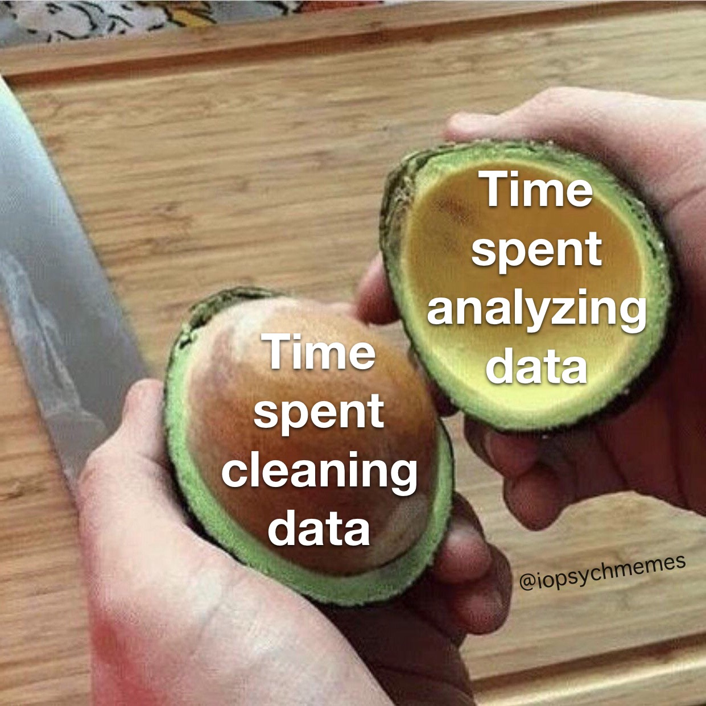
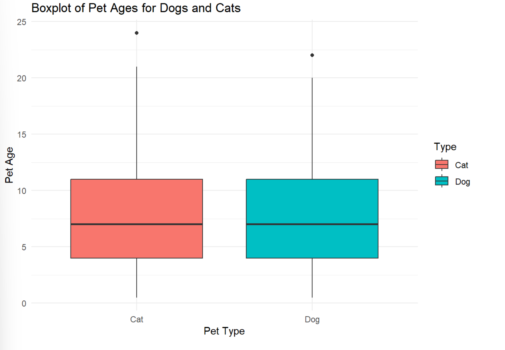
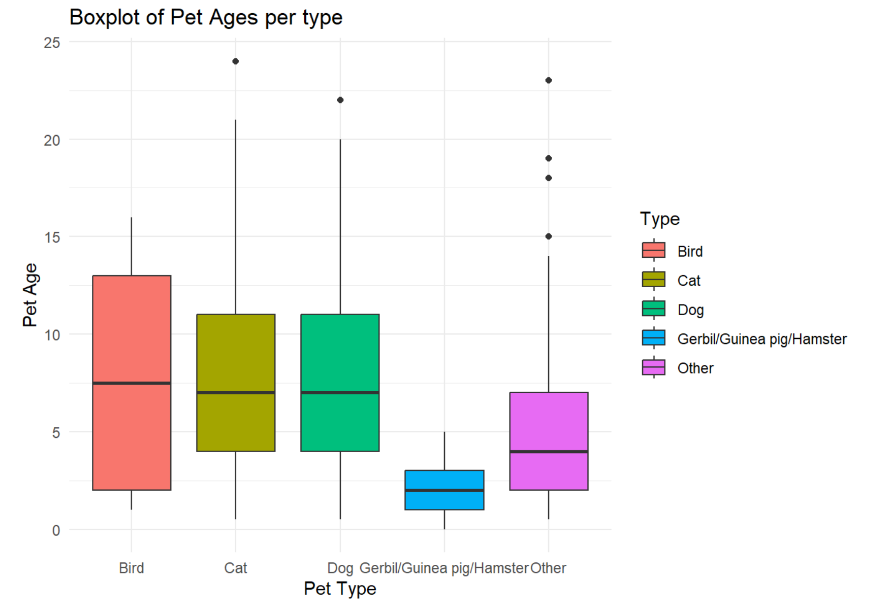
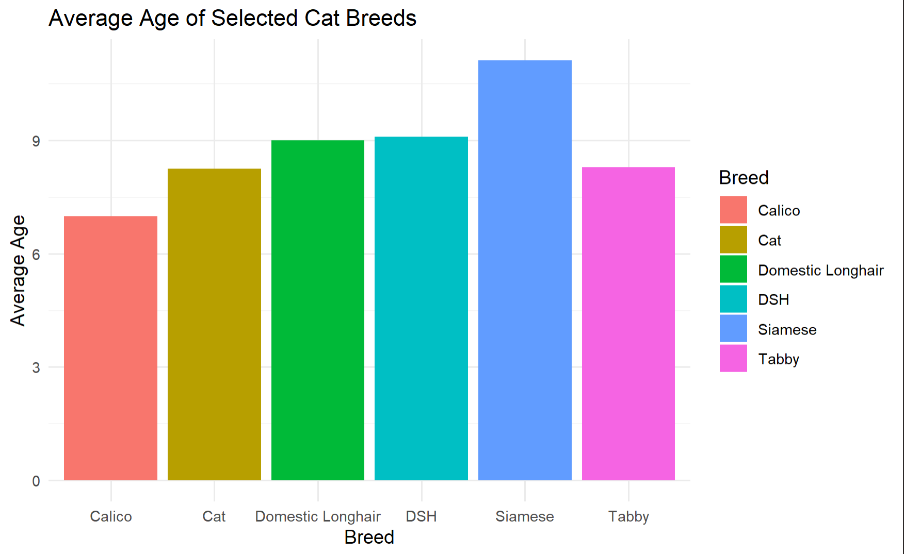

# Cleaning Data in OpenRefine (formerly Google Refine)

## Objective

Practice cleaning messy data sets in OpenRefine. In fact, here's the messiest data set I could find: [petnames.tsv](data/petnames.tsv). Have fun! :laughing: :laughing: :laughing:

## Data

Details about the data set can be found in the following [repository](https://github.com/senior-compsci-2023-2024/petnames)

In a nutshell, this is a survey given to Twitter users asking them about their pets, their pets names, age, and breed. All data inputted was done in FREE RESPONSE. :scream: :scream: :scream:

## Things to do

1. Walk with me through the magical software of OpenRefine and clean this data set. :sparkles: :sparkles: :sparkles:
2. Keep cleaning the dataset on your own. :muscle: :muscle: :muscle:
3. Answer the following questions below about the dataset.

## Questions to answer once the data is cleaned (8 pts)

These questions are only to be answered once the data is cleaned. With that being said, I am leaving it up to you on how you want to answer these questions. You can use OpenRefine, Excel, or R. It's up to you!

If you are using OpenRefine or Excel, put your answers in this README file with the images of your graphs and you explanations/answers to the questions in blockquotes. If you are using R, put your answers in a separate R Markdown file and knit it to a PDF or HTML document, or use a jupyter notebook. All files must be in the repository, they do not need to go into a separate folder.

1. After cleaning the data set, how many rows do you now have in your data set?
   1784
2. How does the average age of a dog compare to the average age of a cat?
   

3. What are the top 5 most popular pet names?
   
   The top 5 full names were Sophie, Bella, Maggie, Charlie, Lily. Note that this is probably really inaccurate because it doesnt account for last names or anything.
4. What are the top 5 most popular everyday pet names? (e.g. Spot, Fluffy, etc.)
   
   The most popular everyday names is Charlie, Daisy, Bella, Max and Lucy.
5. What are the bottom 3 least popular dog breeds? (e.g. Chihuahua, Poodle, etc.)
   
   It appears someone entered the age in the breed column. Also "a mess"??? "Akita" sounds like a real breed.
6. Make a graph showing the average age of each pet type (dog, cat, etc.).
   
7. Make a graph showing the average age of each breed of cat.
   
8. What is your favorite entry in the data set?
   
    Age, because it is actually able to be worked with.
## Proof of work (2 pts)

To show proof that your dataset has been cleaned with OpenRefine, you will be uploading the JSON file that OpenRefine creates when you export your cleaned data set. Name this file `petnames.json` in the [data](data) folder.

You will also be placing your cleaned dataset in the [data](data) folder as `cleanPetnames.csv`.

## Submission

To submit your work push you files to GitHub. Make sure you have the following files in your repository:

- `README.md` with your answers to the questions and images of your graphs.
- `petnames.json` in the [data](data) folder.
- `cleanPetnames.csv` in the [data](data) folder.

I am not requiring the "Ready to Grade @GaelanVenturi" commit message, but I will be checking to see if you have pushed your work to GitHub. I am requiring ***AT LEAST 3 COMMITS*** for this assignment. A lack of commits will result in points lost. If you have not pushed your work to GitHub, you will receive a 0 for this assignment.
