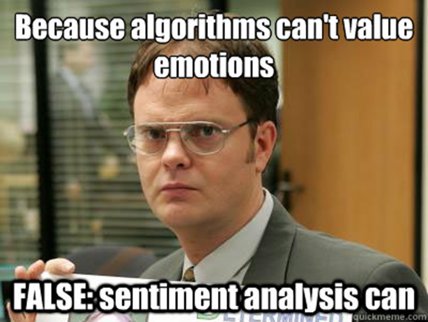

[](https://classroom.github.com/a/iFwN1S6z)
[](https://classroom.github.com/open-in-codespaces?assignment_repo_id=13377688)
# Sentiment Analysis Part 3 - Scraping Text Data



## Objectives

-

## Required Packages

- `rvest`
- `xml2`

## Assignment Instructions and Questions

Text data are every where.  In digital libraries, on facebook, on websites and more.  In this section, you experience collecting data from 3 websites about three dog foods: American Journey (A), Merrick (M), and Blue Buffalo (B),

Websites are built with **HTML source code**.  HTML code includes functions and tags, that  R will exploit to download relevant text from websites.  

Below is an example of HTML code from the [website](https://www.apps.stat.vt.edu/house):

```html
<html>
<head>
<meta http-equiv="content-type" content="text/html; charset=iso-8859-1" />
<title>Leanna House</title>
<meta name="keywords" content="" />
<meta name="description" content="" />
<link rel="stylesheet" type="text/css" href="default.css" />
</head>
<body>

<div id="outer">

 <div id="upbg"></div>

 <div id="inner">

  <div id="header">
   <h1><span>Leanna House</span></h1>
   <h2>Associate Professor, Virginia Tech</h2>
  </div>
 
```

Notice the tags, e.g., `<h1>` and the cascading style of the code.  Specifically,   HTML code often formats content on web pages using **Cascading Style Sheet** (CSS) formats.    CSS  defines pieces or elements of  websites (e.g., paragraphs, lists, sections) with tags and displays them sequentially on the website.

`R` and other softwares uses CSS "selectors"  to scan html sites and select elements of the websites to download.  In our case, we use `R` to download all elements from a website and `R` encodes elements of the elements based on the CSS selectors.  

1. Define three objects within `R` that contain the following URLs:
   1. <https://www.chewy.com/american-journey-lamb-sweet-potato/dp/135817>
   2. <https://www.chewy.com/merrick-real-texas-beef-sweet-potato/dp/227207>
   3. <https://www.chewy.com/blue-buffalo-wilderness-rocky/dp/49343>

2. With the function `read_html()` from the `rvest` package, scrape the sites via the website source code to create objects `webpageA`, `webpageM`, and `webpageB`.
3. Select the paragraph (p) elements from the webpages and assign them to objects `pA`, `pM`, and `pB`.  Print the objects to the console.

Now, we have lists of paragraphs from the websites, indexed by 1, 2, 3, etc. We select the paragraphs of interest. E.g., we select paragraphs that describe foods, list the ingredients, and provides one review.

4. Convert the scraped data to text data for each of the three websites.  Assign the text data to objects `textA`, `textM`, and `textB`.  Print the objects to the console.
5. Make variables for the paragraphs that describe the food. Assign the variables to objects `descA`, `descM`, and `descB`.  Print the objects to the console.
6. Make variables for the paragraphs that list the ingredients. Assign the variables to objects `ingA`, `ingM`, and `ingB`.  Print the objects to the console.
7. Make variables that hold one review from each of the pages. Assign the variables to objects `revA`, `revM`, and `revB`.  Print the objects to the console.
8. Combine the text data into one object `dogFoodText` that pairs with another dataset which includes meta data, `dogFoodMeta`.
9. If `dogFoodText` defines a corpus, how many documents are in the corpus? there are 9 documents 
10. What is the dimension of `dogFoodMeta`? 9, 2
11. In words describe how you would analyze the text data.  E.g., how would you transform the text data to structured data and what methods would you use to summarize the structured data.  From the summaries what is an example insight you might be able to make? For the reviews, I can run a polarity sentiment analysis and find the best reviewed dog food.
12. Complete a text analysis with the dog data. Upload at least one summary you create from the structured version of the dog data and write at least one insight you make from the summary below. All of the reviews were posistive, which is supported by my reading of them. The revM is the most positive, which is also accurate.

## Submission Instructions

You'll be submitting your assignment via GitHub Classroom. Make sure you've committed and pushed your local changes to your remote repo before the deadline. You must have ***AT LEAST 3 COMMITS*** when you submit your assignment.
